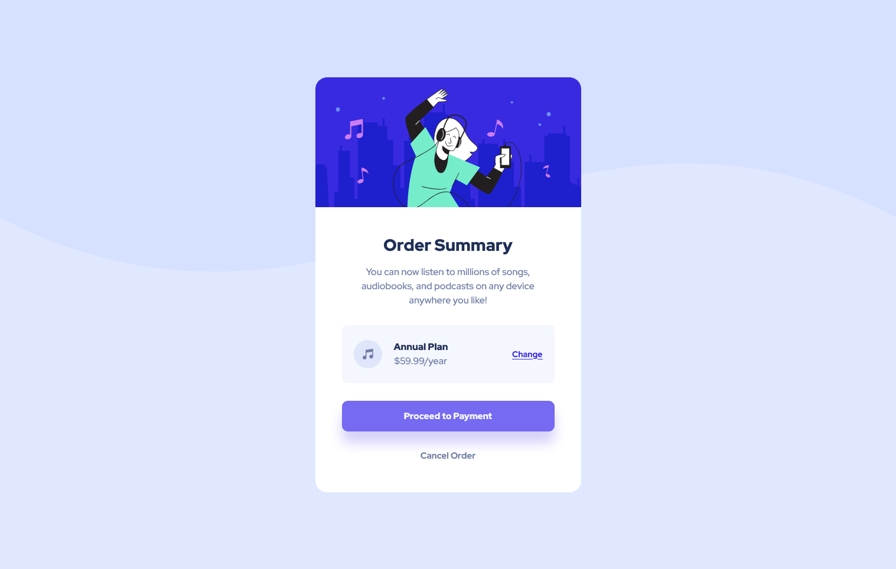

# Frontend Mentor - Order summary card solution

This is a solution to the [Order summary card challenge on Frontend Mentor](https://www.frontendmentor.io/challenges/order-summary-component-QlPmajDUj). Frontend Mentor challenges help you improve your coding skills by building realistic projects.

## Table of contents

-   [Overview](#overview)
    -   [The challenge](#the-challenge)
    -   [Screenshot](#screenshot)
    -   [Links](#links)
-   [My process](#my-process)
    -   [Built with](#built-with)
    -   [What I learned](#what-i-learned)
    -   [Useful resources](#useful-resources)

**Note: Delete this note and update the table of contents based on what sections you keep.**

## Overview

### The challenge

Users should be able to:

-   See hover states for interactive elements

### Screenshot





### Links

-   Live Site URL: [HERE](https://dulcet-fenglisu-43cec3.netlify.app/)

## My process

### Built with

-   Semantic HTML5 markup
-   CSS custom properties
-   Flexbox

### What I learned

I used media quires for the first time and learnt the syntax and when to set appropriate breakpoints.

```css
@media (max-width: 32em) {
    /* Code */
}
```

### Useful resources

-   [Box shadow generator](https://cssgenerator.org/box-shadow-css-generator.html) - This website helped me generate nice looking box-shadows without having to guess the value everytime.
